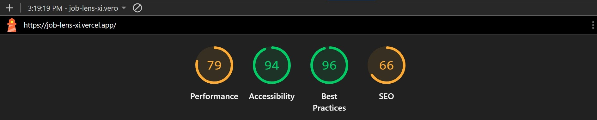
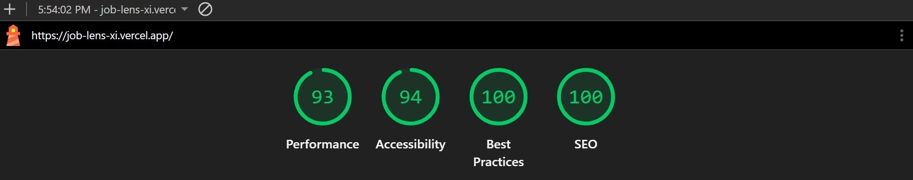
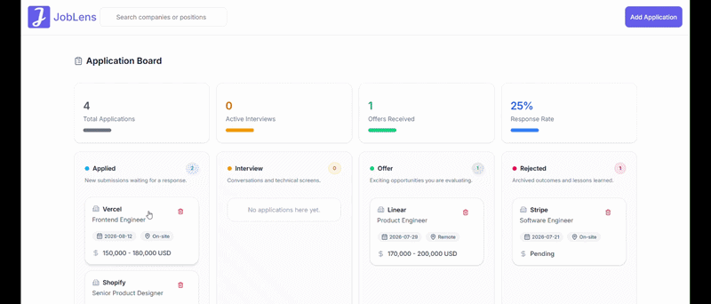

# JobLens

> A focused job application tracker that turns a scattered search into a clear, actionable workflow.

**[View the live production app](https://job-lens-xi.vercel.app/)**

JobLens is a full-stack job application dashboard built for keeping every opportunity visible from first application to final outcome. The kanban workflow makes it easy to see what needs attention, update next steps, and understand progress at a glance.

## Why this project

Job searching creates a surprising amount of operational work: links, follow-ups, interview stages, salary notes, and application dates quickly become difficult to manage. JobLens addresses that friction with a fast, visual workspace designed around the decisions a candidate makes every day.

## Highlights

- Create, edit, and delete application records
- Move applications between Applied, Interview, Offer, and Rejected stages
- Drag and drop cards for quick status updates
- Track company, role, location, salary, job URL, application date, and next step
- See total applications, active interviews, offers, and response rate in summary cards
- Persist data in PostgreSQL through Prisma and server actions
- Responsive interface built for desktop and smaller screens

## Technology

| Area        | Tools                                               |
| ----------- | --------------------------------------------------- |
| Framework   | Next.js 16, React 19                                |
| Language    | TypeScript                                          |
| UI          | Tailwind CSS, shadcn-style components, Lucide icons |
| Interaction | dnd-kit, React Hook Form, Zod                       |
| Data        | Prisma ORM, Neon PostgreSQL                         |
| Deployment  | Vercel                                              |

## Architecture at a glance

- `app/` contains the route, layout, global styles, and server actions.
- `components/` contains the kanban board, application cards, dialogs, forms, and navigation.
- `lib/` contains shared application types and the Prisma client.
- `prisma/` contains the database schema.

The application keeps database writes on the server with Next.js server actions. The client-side board handles interaction and sends status changes back through the application store and server layer.

## Run locally

### Prerequisites

- Node.js 20 or newer
- A PostgreSQL database, such as a Neon project

### Setup

```bash
npm install
```

Create `.env.local` and add your database connection string:

```env
DATABASE_URL="your-neon-connection-string"
```

Generate Prisma Client and sync the schema:

```bash
npx prisma generate
npx prisma db push
```

Start the development server:

```bash
npm run dev
```

Open [http://localhost:3000](http://localhost:3000) to use the app.

## Lighthouse results

The production app was improved and re-tested with Lighthouse. The two reports below show the progression:

| Report         | Performance | Accessibility | Best Practices | SEO |
| -------------- | ----------: | ------------: | -------------: | --: |
| Earlier report |          79 |            94 |             96 |  66 |
| Latest report  |          93 |            94 |            100 | 100 |

<table>
<tr><td></td>
<td></td></tr>
<tr><td align="center">Before</td><td align="center">After</td></tr>
</table>

## What I practiced

This project demonstrates practical experience with:

- Building a typed full-stack workflow with Next.js and TypeScript
- Designing reusable UI components and form validation
- Modeling application data with Prisma
- Implementing optimistic, interaction-heavy drag-and-drop behavior
- Connecting a deployed Next.js app to a hosted PostgreSQL database
- Measuring and improving a production user experience with Lighthouse

## Demo video


